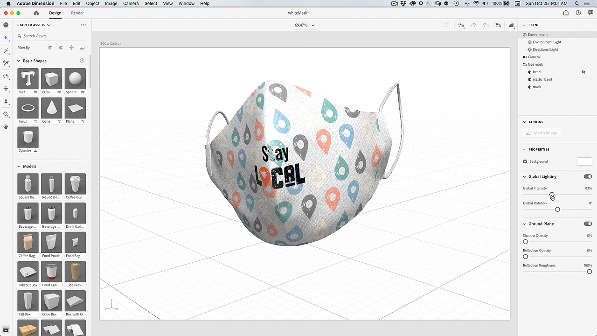

# 设计以打印增效工具 — 自定义人脸蒙版

如果您可以使用自己的图稿自定义人脸蒙版，岂不是很酷？ 借助Adobe Design to Print插件，您可以在数百种Zazzle产品上直观地显示您的设计，并直接发布到其在线市场。

## 浏览Facemask项目Tutorials

<table style="table-layout:fixed">
<tr>
 <td>
   
    

   <a href="handsonproject.md#tutorial1"><strong>安装Photoshop Design to Print Plug-in</strong></a>
    

    <em>使用Adobe Photoshop中功能强大的选择和颜色编辑工具显着更改图像以满足您的企业品牌需求</em>
     
  </td>
  <td>
    
    

    <a href="handsonproject.md#tutorial2"><strong>使用设计自定义脸部蒙版以进行打印</strong></a>
    

    <em>自定义您自己的Zazzle面罩</em>
     
  </td>
  <td>
    
    

   <a href="handsonproject.md#tutorial3"><strong>创建面罩的3D可视化</strong></a>
    

    <em>为事件库创建人脸蒙版的3D可视化</em>
     
  </td>
</tr>
</table>

## 安装Photoshop Design to Print Plug-in(1:50) {#tutorial1}

>[!VIDEO](https://video.tv.adobe.com/v/327096?hidetitle=true)

**说**
明了解如何安装Photoshop的“设计到打印”插件。

在本教程中，您将学习如何：
* 实时在服装、配饰、文具和壁画等产品上呈现您的设计！
* 发布到Dazzle在线市场

**主讲人：Patti**
Sokol，首席解决方案顾问(Digital Media)

## 使用设计自定义脸部蒙版以打印(7:54) {#tutorial2}

>[!VIDEO](https://video.tv.adobe.com/v/327097?hidetitle=true)

**描**
述自定义您自己的Zazzle面罩

在本教程中，您将学习如何：
* 实时在服装、配饰、文具和壁画等产品上呈现您的设计！
* 发布到Dazzle在线市场

**单击“图像”下载“学习设计”以打印PDF**

**主讲人：Patti**
Sokol，首席解决方案顾问(Digital Media)

## 创建脸部蒙版的3D可视化(7:54) {#tutorial3}

>[!VIDEO](https://video.tv.adobe.com/v/327098?hidetitle=true)

**描**
述为事件库创建人脸蒙版的3D可视化

在本教程中，您将学习如何：
* 轻松创建逼真的3D可视化效果
* 为专业外观添加材料和控制照明
* 导入资源以应用您的品牌或其他设计

**单击“图像”以下 [!DNL Dimension] 载带有3D白色蒙版模型的文件**

**主讲人：Patti**
Sokol，首席解决方案顾问(Digital Media)
