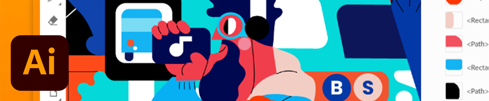
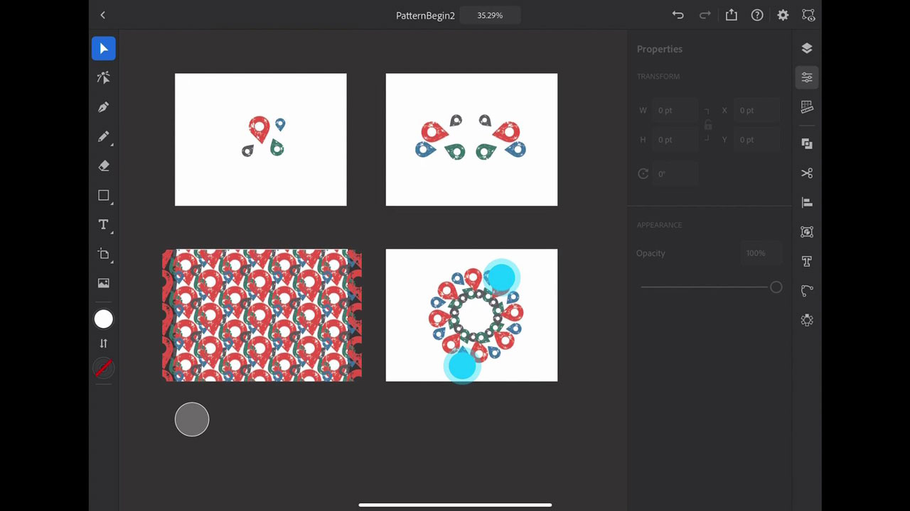

# iPad上的Illustrator

Adobe Illustrator iPad版是一款针对touch、Apple Pencil和iPad重新设计的矢量设计体验。

## 浏览产品Tutorials

<table style="table-layout:fixed">
<tr>
 <td>
   
    

   <a href="illustratoripad.md#tutorial1"><strong>Illustrator iPad简介</strong></a>
    

    <em>创建不良位置图标并将其转换为可应用于您的 [!DNL Dimension] 还有扎兹勒计划！</em>
     
  </td>
  <td>
    
    

     
  </td>
  <td>
    
    

     
  </td>
</tr>
</table>

## Illustrator iPad介绍(9:21) {#tutorial1}

>[!VIDEO](https://video.tv.adobe.com/v/326823?hidetitle=true)

**说明**
这一适用于iPad的Illustrator快速概述将帮助您快速启动并创建不良位置图标，并将其转换为可应用于您的 [!DNL Dimension] 还有扎兹勒计划！

在本教程中，您将学习如何：
* Illustrator针对iPad进行了重新设计，可转变生产力、加快协作、扩展创意技能并增强所有人的创造力
* 触控界面使用Apple Pencil可提供更触动、更精确的体验
* 访问CC Libraries中的图形和颜色
* 在移动设备和桌面之间来回切换工作流Illustrator

**提供者：**
Dave Weinberg，高级解决方案顾问（数字媒体）

**Illustrator on iPad Resources**

[学习和支持](https://helpx.adobe.com/support/illustrator.html) 是更多教程的中心， [新增功能](https://helpx.adobe.com/illustrator/using/whats-new/mobile-2021.html)、以及社区论坛链接。

**2020年10月版**

开始使用这些功能（等等！） 从您的Creative Cloud桌面应用程序下载最新更新。
