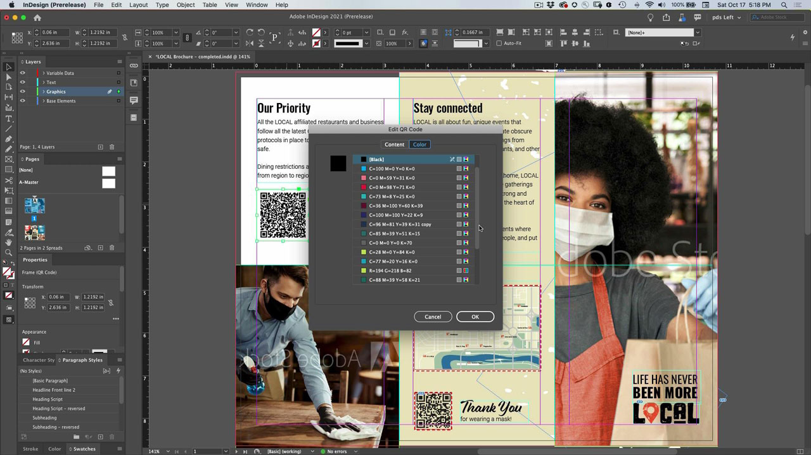
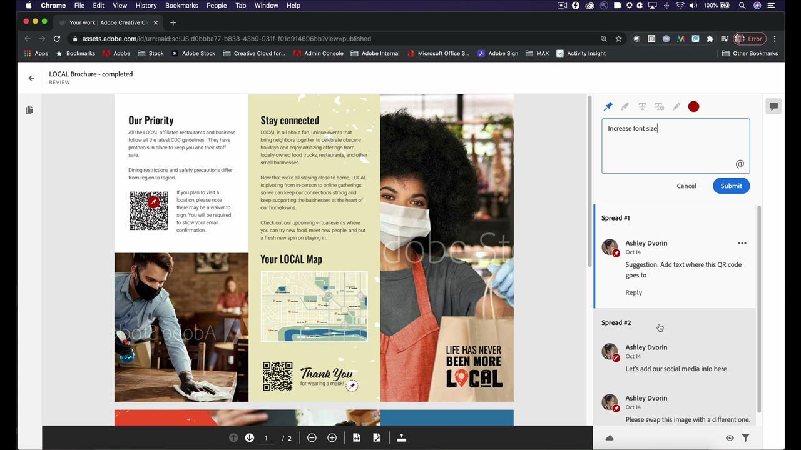
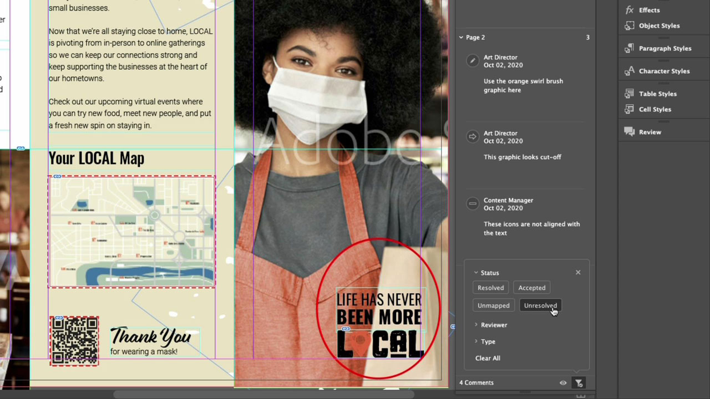
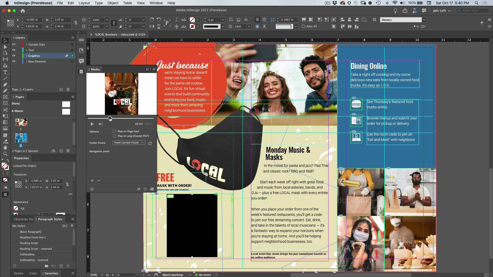
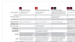

# InDesign

这款行业标准应用程序可创建用于印刷和数字出版的精美文档。 创建丰富的数字和印刷体验，从eBook和电子杂志，到书籍、报告和白皮书。

## 浏览产品Tutorials

<table style="table-layout:fixed">
<tr>
 <td>
    
    

    <a href="indesign.md#tutorial1"><strong>生成二维码</strong></a>
    

    <em>生成链接到网站的QR代码</em>
     
  </td>
  <td>
   
    

   <a href="indesign.md#tutorial2"><strong>从InDesign共享以供审阅</strong></a>
    

    <em>为设计人员及其团队成员提供无缝的创意审阅体验</em>
     
  </td>
  <td>
    
    

    <a href="indesign.md#tutorial3"><strong>从PDF审阅导入Document Cloud注释</strong></a>
    

    <em>将注释从PDF直接导入InDesign并快速应用请求的更改</em>
     
  </td>
</tr>
<tr>
<td>
   
    

   <a href="indesign.md#tutorial4"><strong>将视频文件添加到InDesign文档</strong></a>
    

    <em>将视频添加到InDesign。 输出到PDF和在线发布</em>
     
  </td>
 <td>
    
    

     
 </td>
 <td>
    
    

     
 </td>
</tr>
</table>

## 生成二维码(2:34) {#tutorial1}

>[!VIDEO](https://video.tv.adobe.com/v/326818?hidetitle=true)

**说明**
生成链接到网站的QR代码。

在本教程中，您将学习如何：
* 通过移动设备提供对Web内容的免提访问
* 让您的客户感到安全
* 数字化意味着轻松保持内容最新

**提供者：**
Patti Sokol，首席解决方案顾问（数字媒体）

## 从InDesign共享以供审阅(4:04) {#tutorial2}

>[!VIDEO](https://video.tv.adobe.com/v/326824?hidetitle=true)

**说明**
InDesign共享以供审阅为设计人员及其团队成员提供了更加顺畅的创意审阅体验。

在本教程中，您将学习如何：
* 直接从InDesign发起审阅，无需创建PDF
* 从Web浏览器审阅和注释
* 在一个位置收集多个利益相关者的反馈
* 在可以立即进行更改的应用程序内管理反馈。

**Adobe审阅和注释选项比较PDF**

**提供者：**
Emily Palmer，解决方案顾问(Digital Media)

## 从PDF审阅导入Document Cloud注释(4:52) {#tutorial3}

>[!VIDEO](https://video.tv.adobe.com/v/326959?hidetitle=true)

**说明**
将注释从PDF直接导入InDesign并快速应用请求的更改。

在本教程中，您将学习如何：
* 支持现有的PDF注释工作流程
* 适用于从多个PDF源合并的用户

**Adobe审阅和注释选项比较PDF**

**提供者：**
Michael Murphy，高级解决方案顾问（数字媒体）

## 添加视频文件到InDesign文档(5:58) {#tutorial4}

>[!VIDEO](https://video.tv.adobe.com/v/326757?hidetitle=true)

**说明**
将视频添加到InDesign。 输出到PDF并联机发布。

在本教程中，您将学习如何：
* 将视频添加到InDesign
* 输出到PDF和在线发布

**提供者：**
Patti Sokol，首席解决方案顾问（数字媒体）

**InDesign资源**

[学习和支持](https://helpx.adobe.com/support/indesign.html) 是更多教程的中心， [新增功能](https://helpx.adobe.com/indesign/user-guide.html/indesign/using/whats-new.ug.html)、以及社区论坛链接。

**2020年10月版**

开始使用这些功能（等等！） 从您的Creative Cloud桌面应用程序下载最新更新。
