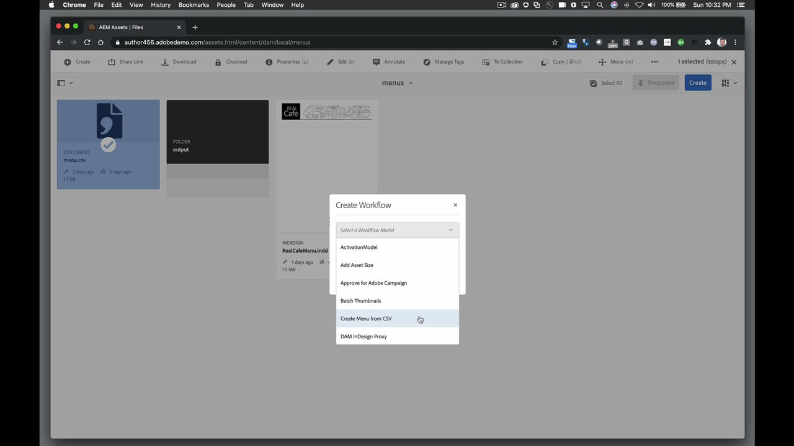
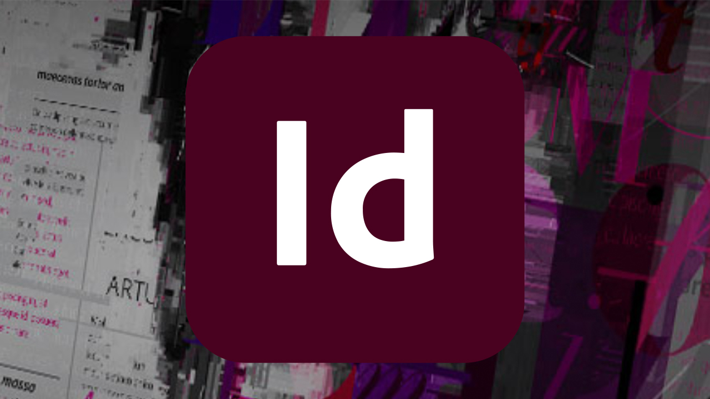

# InDesign Server

Adobe InDesign® Server软件提供强大且可扩展的引擎，该引擎利用InDesign的设计、布局和排版功能，以编程方式创建引人入胜的自动化文档。

## 浏览产品Tutorials

<table style="table-layout:fixed">
<tr>
 <td>
   
    

   <a href="indesignserver.md#tutorial1"><strong>数据驱动的InDesign Server内容</strong></a>
    

    <em>数据驱动设计可以通过编程来实现，并具有InDesign Server</em>
     
  </td>
  <td>
    
    

     
  </td>
  <td>
    
    

     
  </td>
</tr>
</table>

## 数据驱动的InDesign Server内容(4:14) {#tutorial1}

>[!VIDEO](https://video.tv.adobe.com/v/326901?hidetitle=true)

**说明**
数据驱动设计可以通过编程来实现，并具有InDesign Server。

在本教程中，您将学习如何：
* 创建InDesign模板，其中具有预先设置的文本或对象样式
* 在外部数据驱动的内容中流动，以加快内容的个性化
* 生成版面的PDF专色，或绑定到其他AEM驱动的输出格式

**提供者：**
Eric Rowse，高级解决方案顾问（数字媒体）

## 其他InDesign Server资源

<table>
<tr>
 <td>
   
    

   <a href="https://www.adobe.com/products/indesignserver/buying-guide.html"><strong>InDesign Server:购买指南</strong></a>
    

    <em>可供内部开发人员或合作伙伴使用的资源</em>
     
  </td>
  <td>
   
    

   <a href="https://www.adobe.com/products/indesignserver/partner.html"><strong>InDesign Server:查找合作伙伴</strong></a>
    

    <em>虽然您拥有在公司内部开发的专业知识，但Adobe建议与合作伙伴共同寻找满足您要求的解决方案</em>
     
  </td>
  <td>
    
    

     
  </td>
</tr>
</table>

**InDesign Server资源**

[学习和支持](https://www.adobe.com/products/indesignserver.html) 是更多教程、新增功能和社区论坛链接的中心。

**2020年10月版**

开始使用这些功能（等等！） 从您的Creative Cloud桌面应用程序下载最新更新。
