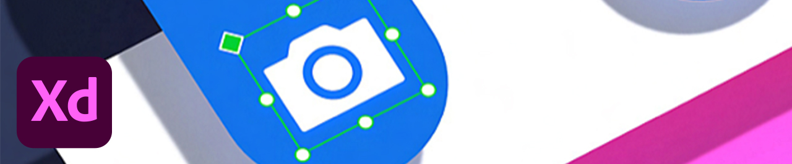

# 教程

作为企业创意人员，您需要与分布式团队协作，建立可扩展的流程，并遵守企业系统和准则。 这些教程将帮助您从企业角度了解Creative Cloud2021版的新增功能。

## Tutorials（按桌面产品）

<table style="table-layout:fixed">
<tr>
 <td>
    
    

    <a href="acrobat-sign.md"><strong>Acrobat和Adobe Sign</strong></a>
    

    <em>创建、编辑和签署PDF文档和表单</em>
     
  </td>
  <td>
    
    

    <a href="dimension.md"><strong>Dimension</strong></a>
    

    <em>创建用于品牌、产品拍摄和包装设计的逼真3D图像</em>
     
  </td>
  <td>
    
    

    <a href="illustrator.md"><strong>Illustrator</strong></a>
    

    <em>矢量图和插图</em>
     
  </td>
</tr>
<tr>
 <td>
    
    

    <a href="indesign.md"><strong>InDesign</strong></a>
    

    <em>针对印刷和数字出版的页面设计和版面</em>
     
  </td>
  <td>
    
    

    <a href="photoshop.md"><strong>Photoshop</strong></a>
    

    <em>在桌面上编辑、合成和创建精美的图像、图形和图稿</em>
     
  </td>
  <td>
    
    

    <a href="rush.md"><strong>Rush</strong></a>
    

    <em>随时随地创建和分享在线视频</em>
     
  </td>
</tr>
<tr>
 <td>
    
    

    <a href="xd.md"><strong>XD</strong></a>
    

    <em>设计和分享用户体验并为其创建原型</em>
     
  </td>
  <td>
    
    

     
  </td>
  <td>
    
    

     
  </td>
</tr>
</table>

### Tutorials（按移动应用程序）

<table style="table-layout:fixed">
<tr>
 <td>
    
    

    <a href="capture.md"><strong>Capture</strong></a>
    

    <em>将任意图像转换为颜色主题、矢量图形、画笔等</em>
     
  </td>
  <td>
    
    

    <a href="fresco.md"><strong>Fresco</strong></a>
    

    <em>重拾随时随地绘画和绘图的乐趣</em>
     
  </td>
  <td>
    
    

    <a href="illustratoripad.md"><strong>iPad 版 Illustrator</strong></a>
    

    <em>矢量图和插图</em>
     
  </td>
</tr>
<tr>
 <td>
    
    

    <a href="photoshopipad.md"><strong>iPad 版 Photoshop</strong></a>
    

    <em>在桌面端和 iPad 上编辑、合成和创建精美的图像、图形和艺术作品</em>
     
  </td>
  <td>
    
    

     
  </td>
  <td>
    
    

     
  </td>
</tr>
</table>

### Tutorials（按集成）

<table style="table-layout:fixed">
<tr>
 <td>
    
    

    <a href="aem.md"><strong>AEM Assets和Asset Link</strong></a>
    

    <em>新一代数字资产管理</em>
     
  </td>
  <td>
    
    

    <a href="creativeclouddesktopapp.md"><strong>Creative Cloud 桌面应用程序</strong></a>
    

    <em>Creative Cloud桌面应用程序是管理CC应用程序、服务和协作等的中心！</em>
     
  </td>
  <td>
    
    

    <a href="cclibraries.md"><strong>CC Libraries</strong></a>
    

    <em>让您的资源随时可用，让您的项目保持品牌特色</em>
     
  </td>
</tr>
<tr>
<td>
    
    

    <a href="indesignserver.md"><strong>InDesign Server</strong></a>
    

    <em>精良的InDesign工具与自定义自动化</em>
     
  </td>
 <td>
    
    

    <a href="stock.md"><strong>Adobe [!DNL Stock]</strong></a>
    

    <em>高质量的数字图像、插图、视频、音频、模板等</em>
     
  </td>
  <td>
    
    

     
  </td>
</tr>
</table>

### 动手项目：创建您自己的蒙版

<table style="table-layout:fixed">
<tr>
 <td>
    
    

    <a href="handsonproject.md"><strong>创建您自己的蒙版</strong></a>
    

    <em>借助“Adobe设计到打印”增效工具，您可以在数百个Zazzle产品上使设计可视化，并直接发布到其在线市场</em>
     
  </td>
  <td>
    
    

     
  </td>
  <td>
    
    

     
  </td>
</tr>
</table>
