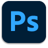

# Photoshop on iPad

Photoshop是世界上最好的图像和图形设计软件，可为不同设备的专业人士提供无限的创意。 现在，任何人都可以创作想象到的任何东西，灵感随处可见。 如果你能想到，你可以用Photoshop。

## 浏览产品Tutorials

<table style="table-layout:fixed">
<tr>
 <td>
   
    

   <a href="photoshopipad.md#tutorial1"><strong>iPad上的Photoshop简介</strong></a>
    

    <em>浏览界面并了解Photoshop中的一些功能，这些功能经过重新设计，可在Apple iPad上使用</em>
     
  </td>
  <td>
    
    

     
  </td>
  <td>
    
    

     
  </td>
</tr>
</table>

## iPad上的Photoshop简介(5:14) {#tutorial1}

>[!VIDEO](https://video.tv.adobe.com/v/326899?hidetitle=true)

**描**
述浏览界面并了解Photoshop中的一些功能，这些功能经过重新设计后可在Apple iPad上使用。

在本教程中，您将学习如何：
* 访问您最喜爱的Photoshop工具，
* 在移动设备上进行精确编辑，而不影响质量
* 更身临其境、更自然的体验
* 使用Cloud Docs实现无缝的工作流

**演示者：Dan**
Armstrong，解决方案顾问（数字媒体）

**Photoshop在iPad资源上**

[学习和支持](https://helpx.adobe.com/support/photoshop.html) 是您的中心，提供更多教程和社区论坛链接。

**2020年10月版**

开始使用这些功能（等等！） 从Creative Cloud桌面应用程序下载最新更新。
