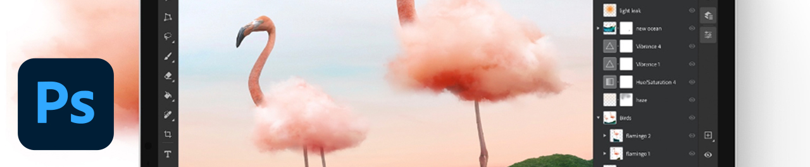

# iPad上的Photoshop

Photoshop是世界一流的图像处理和图形设计软件，可让专业人士在不同设备上尽情发挥创意。 现在，任何人都可以在灵感迸发时创造自己想象的一切。 如果你能想得到，你就能利用Photoshop。

## 浏览产品Tutorials

<table style="table-layout:fixed">
<tr>
 <td>
   
    

   <a href="photoshopipad.md#tutorial1"><strong>Photoshop iPad简介</strong></a>
    

    <em>浏览界面，了解Photoshop中重新设计并在Apple iPad上使用的部分功能</em>
     
  </td>
  <td>
    
    

     
  </td>
  <td>
    
    

     
  </td>
</tr>
</table>

## Photoshop iPad介绍(5:14) {#tutorial1}

>[!VIDEO](https://video.tv.adobe.com/v/326899?hidetitle=true)

**说明**
浏览界面，了解Photoshop中重新设计并在Apple iPad上使用的部分功能。

在本教程中，您将学习如何：
* 在
* 在移动设备上实现精准编辑，同时不影响质量
* 更引人入胜的自然体验
* 使用云文档的无缝工作流程

**提供者：**
Dan Armstrong，解决方案顾问（数字媒体）

**Photoshop on iPad Resources**

[学习和支持](https://helpx.adobe.com/support/photoshop.html) 是更多教程和社区论坛链接的中心。

**2020年10月版**

开始使用这些功能（等等！） 从您的Creative Cloud桌面应用程序下载最新更新。
