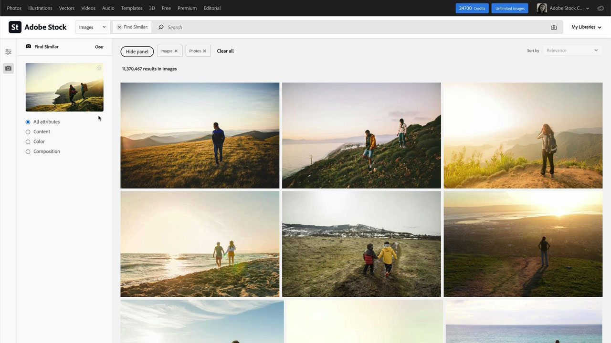

# [!DNL Stock]

!

创意人员面临着快速提供视觉上引人入胜的新内容以吸引和吸引注意力的压力。 Adobe [!DNL Stock]企业版使创意团队能够访问超过2亿个图像、视频、模板、插图、音频文件和3D资源 — 所有这一切均可在每天使用的Adobe创意应用程序中实现。

## 浏览产品Tutorials

<table style="table-layout:fixed">
<tr>
 <td>
   
    

   <a href="stock.md#tutorial1"><strong>使用Adobe [!DNL Stock]更快地查找最佳资源</strong></a>
    

    <em>查找完美的免版税库存图像，以便使用以Adobe Sensei（我们的人工智能引擎）为后盾的更好、更快的搜索结果增强您的创意项目</em>
     
  </td>
  <td>
   
    

   <a href="stock.md#tutorial2"><strong>在Adobe Experience Manager中搜索和许可[!DNL Stock]资源</strong></a>
    

    <em>简化将许可的Adobe[!DNL Stock]资源上传到数字资产管理系统的过程</em>
     
  </td>
  <td>
    
    

     
  </td>
</tr>
</table>

## 使用Adobe [!DNL Stock](10:49)更快地查找最佳资源 {#tutorial1}

>[!VIDEO](https://video.tv.adobe.com/v/326951?hidetitle=true)

**描**
述查找完美的免版税库存图像，以便使用以我们的人工智能引擎Adobe Sensei为后盾的更好、更快的搜索结果来增强您的创意项目。

在本教程中，您将学习如何：
* 在搜索高品质图像和视频时花费时间和精力
* 轻松管理和跟踪整个企业的资产许可证和使用情况
* 直接在Adobe Creative Cloud应用程序中搜索、预览和许可

**呈列者：**

Victoria Torres，[!DNL Stock]解决方案顾问（数字媒体）

## 在AEM中搜索并许可[!DNL Stock]资源(6:46) {#tutorial2}

>[!VIDEO](https://video.tv.adobe.com/v/326952?hidetitle=true)

**描**
述简化将许可的Adobe资 [!DNL Stock] 源上传到Digital Asset Management系统的过程。

在本教程中，您将学习如何：
* 在不离开AEM工作区的情况下执行Adobe[!DNL Stock]资源搜索
* 在许可时将许可的资源直接保存到AEM文件夹
* 在[!DNL Stock]网站的[!DNL Stock]许可证历史记录中查看从AEM许可的资源。

**演示者：**
Emily Palmer，解决方案顾问(Digital Media)

![[!DNL Stock] 徽标](../assets/st_appicon_96.png)

**Adobe [!DNL Stock] 资源**

[学习和支持](https://helpx.adobe.com/support/stock.html) 是您的中心，提供更多教程和社区论坛链接。

**2020年10月版**

开始使用这些功能（等等！） 从Creative Cloud桌面应用程序下载最新更新。
