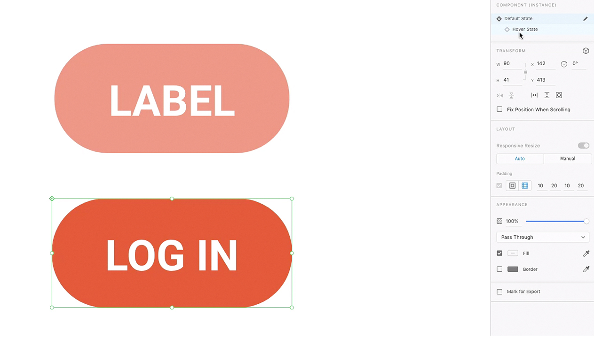
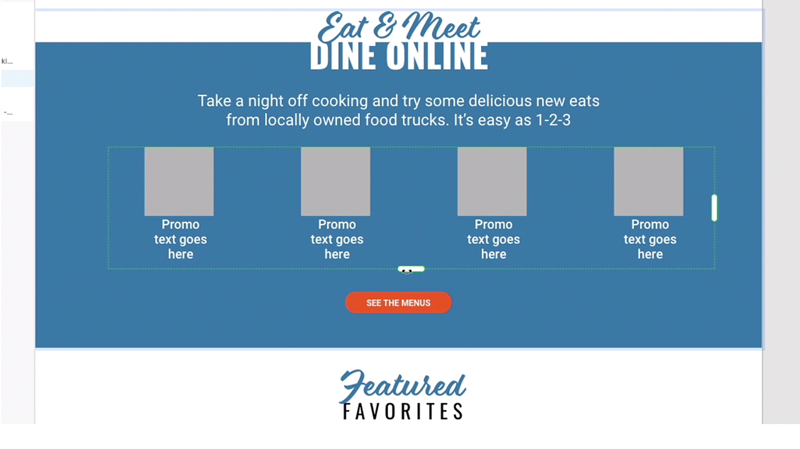
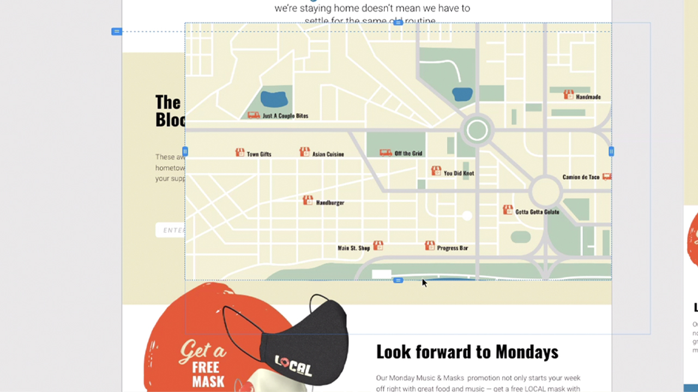
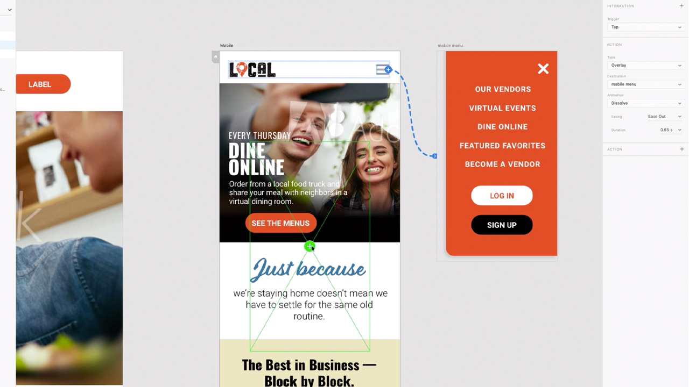
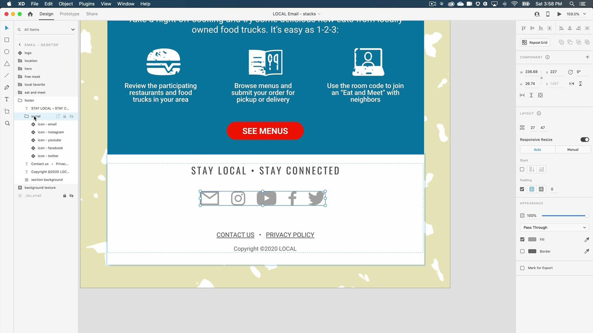

# XD

Adobe XD是一款用户体验设计和原型创建工具，用于设计网站、应用程序、语音界面、游戏和其他类型的数字体验。

## 浏览产品Tutorials

<table style="table-layout:fixed">
<tr>
 <td>
   
    

   <a href="xd.md#tutorial1"><strong>创建具有悬停状态的组件</strong></a>
    

    <em>为交互式设计创建可重复使用、可动态调整大小的按钮</em>
     
  </td>
  <td>
    
    

    <a href="xd.md#tutorial2"><strong>创建和填充重复网格</strong></a>
    

    <em>只需单击并拖动，即可将单个元素转换为重复网格</em>
     
  </td>
  <td>
   
    

    <a href="xd.md#tutorial3"><strong>使用堆栈</strong></a>
    

    <em>使用stack属性可轻松重新排列元素</em>
     
  </td>
</tr>
<tr>
 <td>
    
    

    <a href="xd.md#tutorial4"><strong>创建原型 — 锚点链接和滚动组</strong></a>
    

    <em>向原型添加导航和滚动</em>
     
  </td>
  <td>
    
    

    <a href="xd.md#tutorial5"><strong>创建原型 — 交互组件状态</strong></a>
    

    <em>为原型添加交互性和叠加菜单</em>
     
  </td>
  <td>
   
    

   <a href="xd.md#tutorial7"><strong>电子邮件 — 创建和填充重复网格</strong></a>
    

    <em>只需单击并拖动，即可将单个元素转换为重复网格</em>
     
  </td>
</tr>
<tr>
 <td>
    
    

    <a href="xd.md#tutorial7"><strong>电子邮件 — 使用堆栈</strong></a>
    

    <em>使用stack属性可轻松重新排列元素</em>
     
  </td>
  <td>
    
    

     
  </td>
  <td>
    
    

     
  </td>
</tr>
</table>

## 创建具有悬停状态的[!UICONTROL 组件](7:35) {#tutorial1}

>[!VIDEO](https://video.tv.adobe.com/v/326874?hidetitle=true)

**描**
述为交互式设计创建可重复使用、可动态调整大小的按钮。

在本教程中，您将学习如何：
* 对源主组件进行更改，这些更改会自动推送到该组件的所有实例
* 使用组件实现一致性、节省时间、减少点击次数

**演示者：Michael**
Murphy，高级解决方案顾问（数字媒体）

## 创建和填充重复网格(2:57) {#tutorial2}

>[!VIDEO](https://video.tv.adobe.com/v/326955?hidetitle=true)

**描**
述通过简单的单击和拖动操作，将单个元素转换为重复网格。

在本教程中，您将学习如何：
* 提升工作流程并立即拖出所需的任意大小的网格
* 引入真实的内容和数据，XD将神奇地将所有图像和文本置入您的网格中
* 只需更改一次，即可在任意方向应用

**演示者：Ashley**
Dvorin，高级解决方案顾问（数字媒体）

## 使用堆栈(5:33) {#tutorial3}

>[!VIDEO](https://video.tv.adobe.com/v/326956?hidetitle=true)

**描**
述使用stack属性可轻松地重新排列元素。

在本教程中，您将学习如何：
* 即使在设计发生变化时，也保持画布上对象之间的对齐和间距
* 在堆栈中插入新对象或重新排序对象，所有对象都会自动调整

**演示者：Michael**
Murphy，高级解决方案顾问（数字媒体）

## 创建原型 — 锚点链接和滚动组(9:55) {#tutorial4}

>[!VIDEO](https://video.tv.adobe.com/v/326957?hidetitle=true)

**描**
述向原型添加导航和滚动。

在本教程中，您将学习如何：
* 使用允许用户跳到同一画板上不同点的动作，添加指向原型的链接
* 通过定义独立于其他设计滚动的区域，创建活动源、图像轮盘、产品列表等
* 创建垂直、水平或同时滚动的组

**演示者：Michael**
Murphy，高级解决方案顾问（数字媒体）

## 创建原型 — 交互组件状态(8:55) {#tutorial5}

>[!VIDEO](https://video.tv.adobe.com/v/326958?hidetitle=true)

**描**
述向原型添加交互性和叠加菜单。

在本教程中，您将学习如何：
* 无需额外画板即可创建非线性交互式动画用户体验
* 在单个XD文档中创作多个原型或交互流，并为每个流发布唯一的可共享链接

**作者：Emilie**
Enke，协理解决方案顾问(Digital Media)

## 电子邮件 — 创建和填充重复网格(4:45) {#tutorial6}

>[!VIDEO](https://video.tv.adobe.com/v/326775?hidetitle=true)

**描**
述通过简单的单击和拖动操作，将单个元素转换为重复网格。

在本教程中，您将学习如何：
* 提升工作流程并立即拖出所需的任意大小的网格
* 引入真实的内容和数据，XD将神奇地将所有图像和文本置入您的网格中
* 只需更改一次，即可在任意方向应用

**提交人：Victoria**
Torres，解决方案顾问(Digital Media)

## 电子邮件 — 使用堆栈(3:38) {#tutorial7}

>[!VIDEO](https://video.tv.adobe.com/v/326759?hidetitle=true)

**描**
述使用stack属性可轻松地重新排列元素。

在本教程中，您将学习如何：
* 即使在设计发生变化时，也保持画布上对象之间的对齐和间距
* 在堆栈中插入新对象或重新排序对象，所有对象都会自动调整

**提交人：Victoria**
Torres，解决方案顾问(Digital Media)

**XD资源**

[学习和](https://helpx.adobe.com/support/xd.html) 支持是您的中心，您可以获取更多教 [程、新增功能](https://helpx.adobe.com/xd/user-guide.html/xd/help/whats-new.ug.html)，以及社区论坛的链接。

**2020年10月版**

开始使用这些功能（等等！） 从Creative Cloud桌面应用程序下载最新更新。
