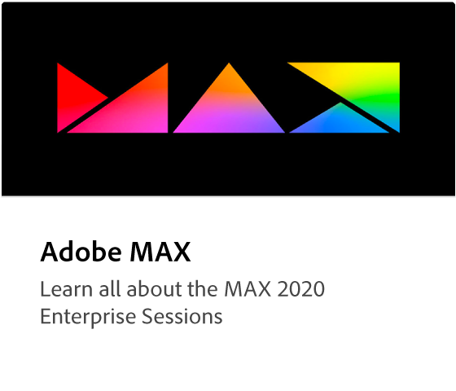

# 企业教程Creative Cloud

欢迎访问企业学习Creative Cloud中心。 您可以在此处找到大量侧重于企业Creative Cloud的学习体验。 我们的教程、网络研讨会和用例旨在让初学者和管理人员快速了解企业产品Creative Cloud。

## 浏览主题

<table style="table-layout:fixed">
<tr>
  <td>
    
  </td>
  <td>
    
  </td>
  <td>
    
  </td>
  <td>
    
  </td>
</tr>
  <td>
   
  </td>
  <td>
  
  </td>
  <td>
    
  </td>
  <td>
    
  </td>
</tr>
</table>
