# Adobe[!DNL Stock]教程

!

创意人员面临着快速提供引人注目的新内容的压力，这些内容可以吸引和吸引人们的注意力。 Adobe [!DNL Stock]企业版使创意团队能够访问超过2亿个图像、视频、模板、插图、音频文件和3D资源 — 所有这一切均可在每天使用的Adobe创意应用程序中实现。

## 单击可查看Adobe[!DNL Stock]教程

<table>
<tr>
   <td>
      <a href="searchstock.md">
         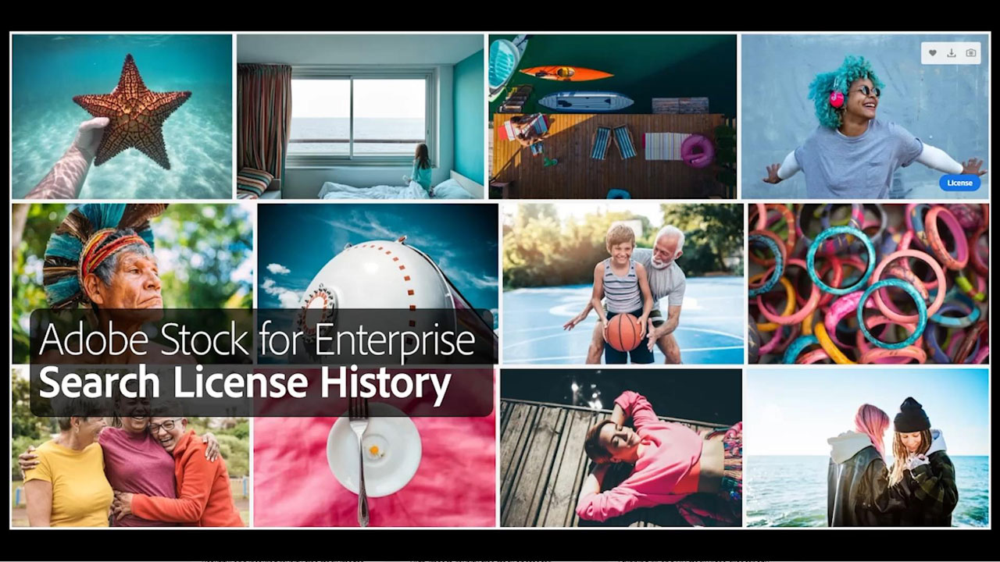
      </a>
      

      <a href="searchstock.md"><strong>搜索Adobe[!DNL Stock]许可历史记录</strong></a>
      

      <em>了解如何在Creative Cloud企业版中快速搜索您组织的Adobe[!DNL Stock]许可历史记录</em>
       
  </td>
  <td>
      <a href="handdrawn.md">
         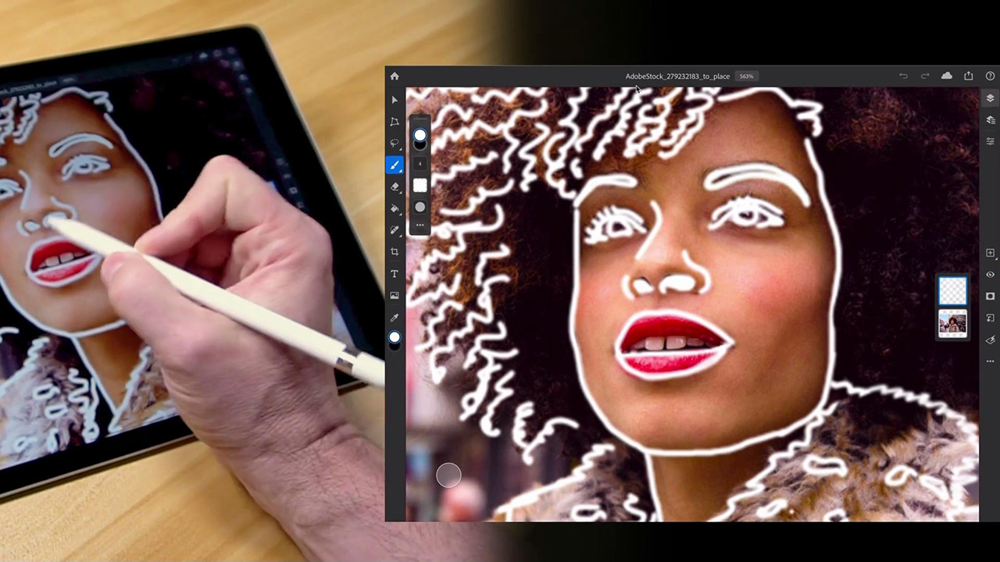
      </a>
      

      <a href="handdrawn.md"><strong>向Adobe[!DNL Stock]图像添加手绘美感</strong></a>
      

      <em>使用Photoshop for iPad的独特技术增强您的创意营销，为您的图像增添深度和维度</em>
       
  </td>
  <td>
   <a href="flairtypography.md">
      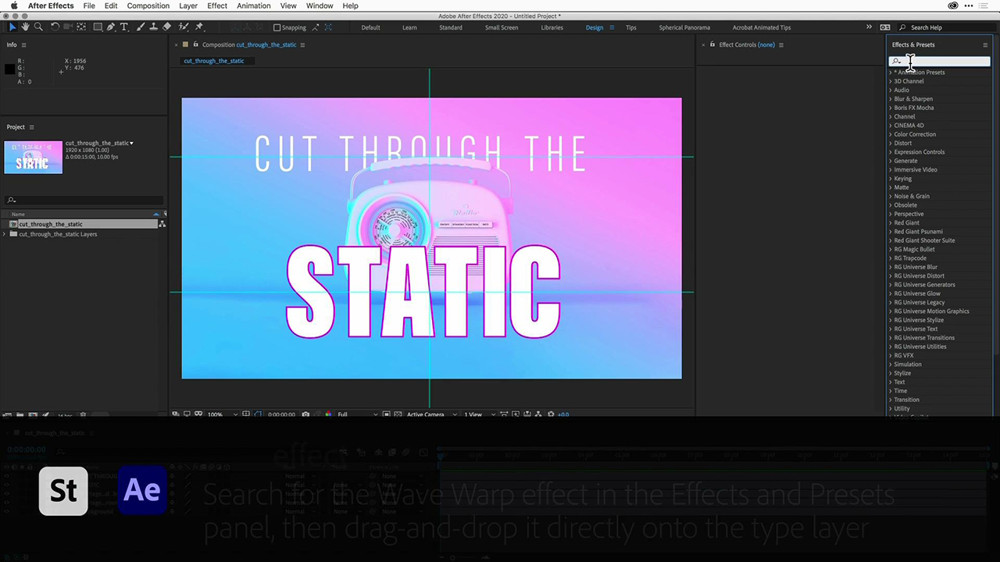
   </a>
    

   <a href="flairtypography.md"><strong>通过蒙版和动画为排版增色</strong></a>
    

    <em>使用Adobe [!DNL Stock]中的元素和After Effects中的动画样式使文本栩栩如生</em>
     
  </td>
</tr>
<tr>
   <td>
      <a href="animatevector.md">
         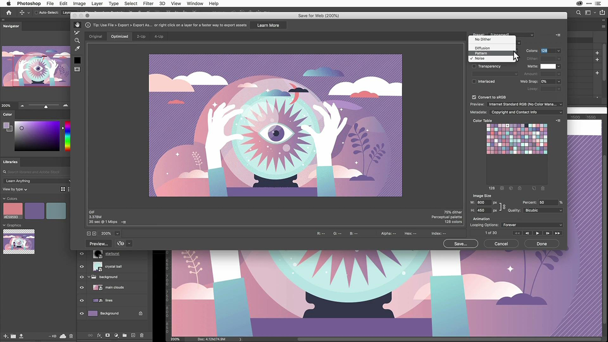
      </a>
      

      <a href="animatevector.md"><strong>在Photoshop中为Adobe[!DNL Stock]矢量插图制作动画</strong></a>
      

      <em>使用可编辑矢量将Adobe[!DNL Stock]导入新闻稿图形</em>
       
  </td>
   <td>
      <a href="annualreport.md">
         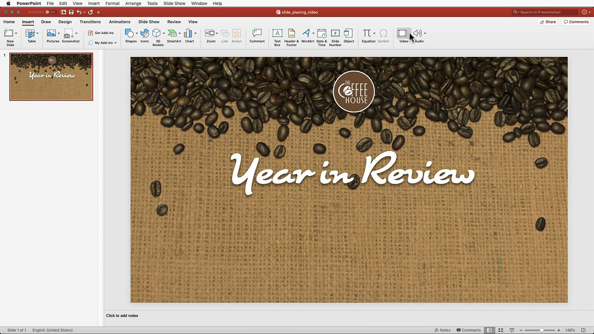
      </a>
      

      <a href="annualreport.md"><strong>从使用Adobe [!DNL Stock]和Spark Video创建的视频开始年度报告</strong></a>
      

      <em>利用Adobe [!DNL Stock]和Spark Video，将年度报告变为故事</em>
       
  </td>
  <td>
      <a href="customanimations.md">
         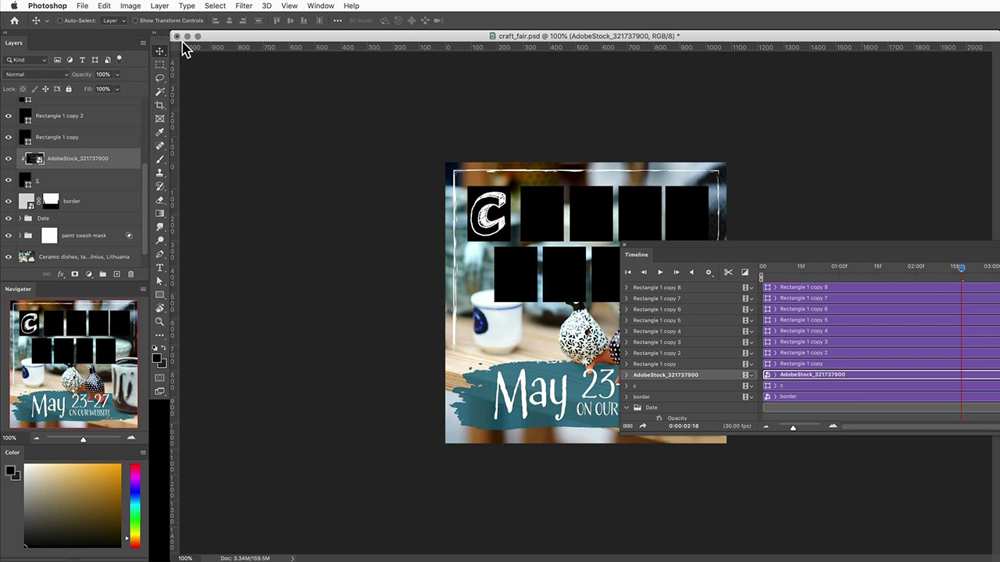
      </a>
      

      <a href="customanimations.md"><strong>通过Adobe [!DNL Stock]自定义动画栩栩如生地呈现创意</strong></a>
      

      <em>在Photoshop中使用Adobe [!DNL Stock]图像、纹理、图案来自定义动画</em>
       
  </td>
</tr>
<tr>
   <td>
      
      

      <a href="changecolors.md"><strong>更改Adobe[!DNL Stock]图像的颜色以匹配您的故事</strong></a>
      

      <em>在Adobe [!DNL Stock]中查找独特照片，然后在Adobe Photoshop中调整颜色以满足您的需要</em>
       
  </td>
  <td>
      <a href="collage.md">
         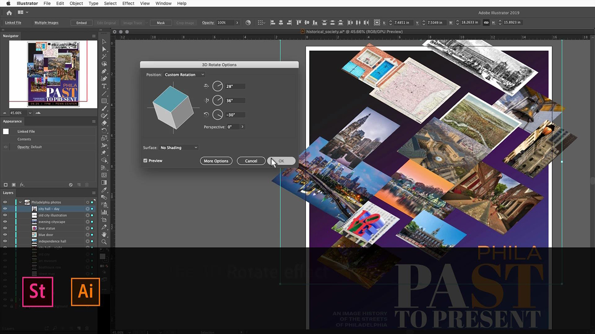
      </a>
      

      <a href="collage.md"><strong>使用Adobe[!DNL Stock]图像为海报创建3D拼贴画</strong></a>
      

      <em>在Adobe Illustrator中设计拼贴画，其中Adobe [!DNL Stock]中图像具有引人注目的3D效果</em>
       
  </td>
  <td>
      <a href="boldlabel.md">
         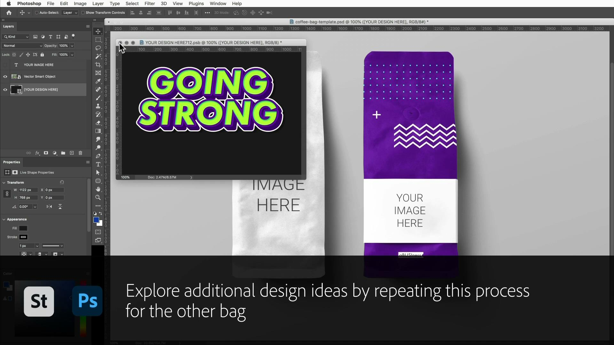
      </a>
      

      <a href="boldlabel.md"><strong>使用Adobe[!DNL Stock]模板和Photoshop智能对象创建粗体标签</strong></a>
      

      <em>使用Adobe [!DNL Stock]中逼真的打包模板设计和可视化自定义设计</em>
       
  </td>
</tr>
<tr>
   <td>
      <a href="infographic.md">
         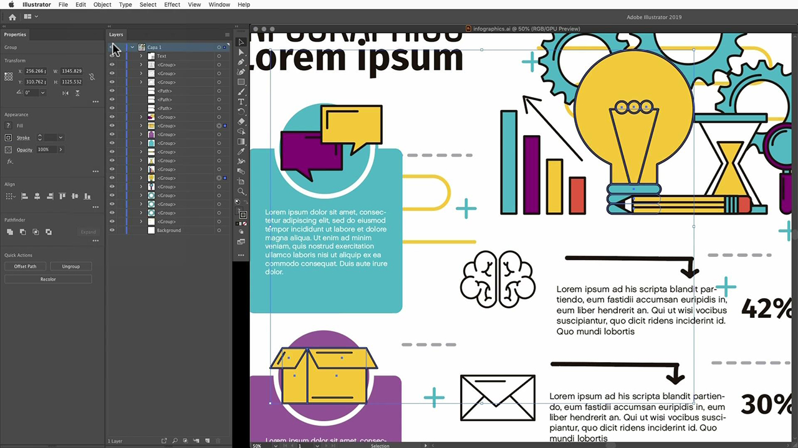
      </a>
      

      <a href="infographic.md"><strong>使用Adobe [!DNL Stock]创建公司指南信息图</strong></a>
      

      <em>将Adobe [!DNL Stock]中的各种资源组合在一起，以具有视觉吸引力的信息图形形式传达指导原则</em>
       
  </td>
 <td>
      <a href="featurecomparison.md">
         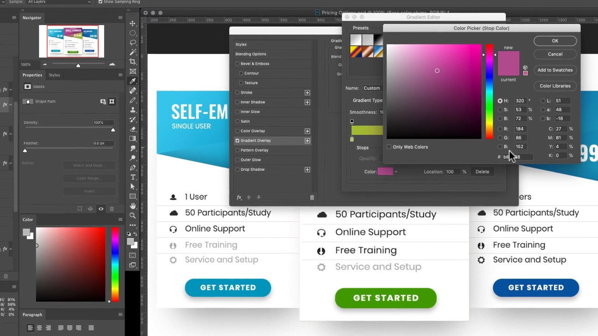
      </a>
      

      <a href="featurecomparison.md"><strong>使用Adobe [!DNL Stock]创建产品功能比较图表</strong></a>
      

      <em>创建一个图形，比较产品定价计划，为潜在客户提供他们需要的信息概览</em>
       
  </td>
  <td>
      <a href="surrealcomposite.md">
         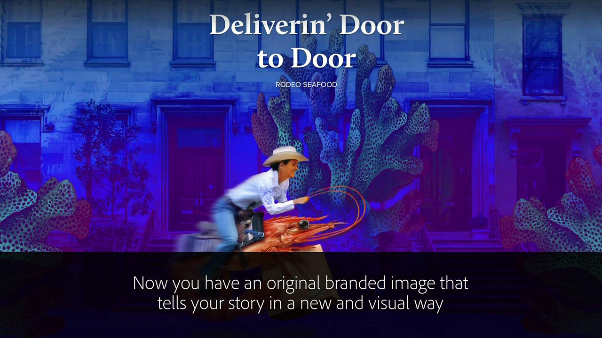
      </a>
      

      <a href="surrealcomposite.md"><strong>使用Adobe[!DNL Stock]创建半超现实复合</strong></a>
      

      <em>通过将多个图像与颜色、运动和蒙版效果相结合，创建令人难忘的编辑图像</em>
       
  </td>
</tr>
<tr>
   <td>
      <a href="surrealpattern.md">
         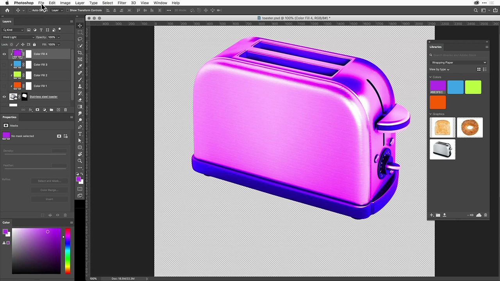
      </a>
      

      <a href="surrealpattern.md"><strong>使用Adobe[!DNL Stock]创建半超现实图案</strong></a>
      

      <em>基于来自Adobe [!DNL Stock]的超现实图像创建精美的无缝图案</em>
       
  </td>
   <td>
      <a href="productconfigurator.md">
         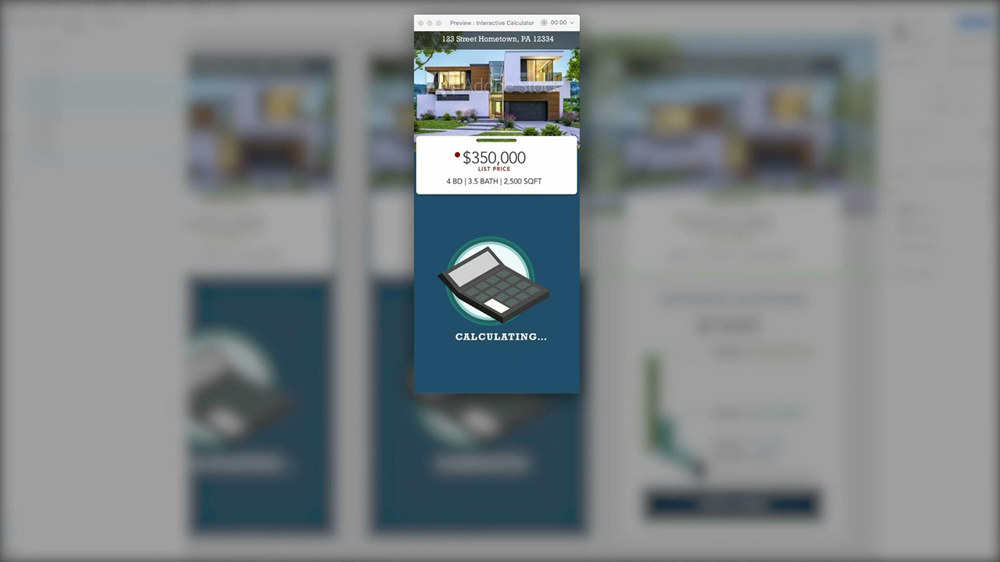
      </a>
      

      <a href="productconfigurator.md"><strong>使用Adobe[!DNL Stock]创建交互式产品配置器</strong></a>
      

      <em>使用Adobe [!DNL Stock]中的交互性、动画和可编辑图稿的强大功能，以可视方式显示财务信息</em>
       
  </td>
  <td>
      <a href="interactivetourismphoto.md">
         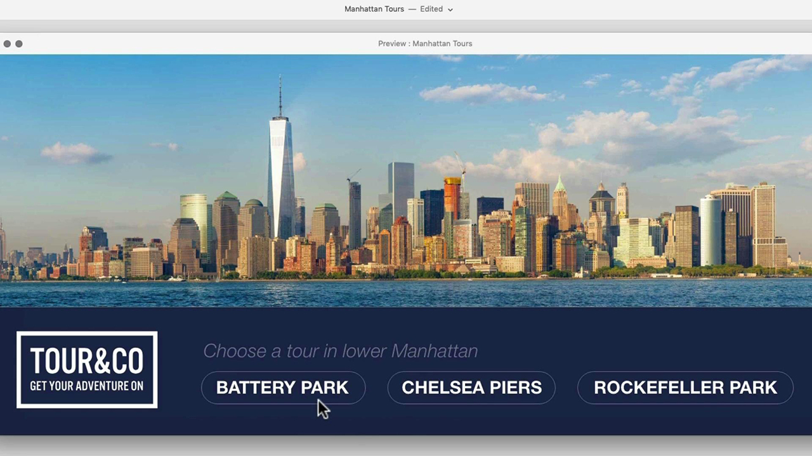
      </a>
      

      <a href="interactivetourismphoto.md"><strong>使用Adobe [!DNL Stock]和XD创建交互式旅游照片</strong></a>
      

      <em>使用Adobe [!DNL Stock] &amp; XD在网站原型中快速创建交互式照片</em>
       
  </td>
</tr>
<tr>
   <td>
      <a href="animationemail.md">
         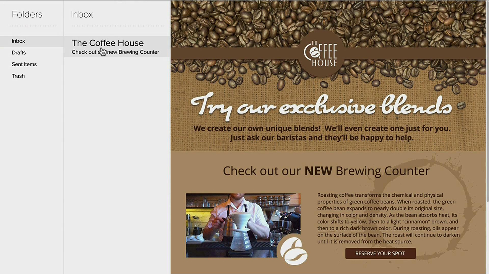
      </a>
      

      <a href="animationemail.md"><strong>使用Adobe [!DNL Stock]和Photoshop为电子邮件创建动画</strong></a>
      

      <em>借助Adobe [!DNL Stock]和Photoshop，通过停止动作动画增强您的电子邮件功能</em>
       
  </td>
 <td>
      <a href="brandgradients.md">
         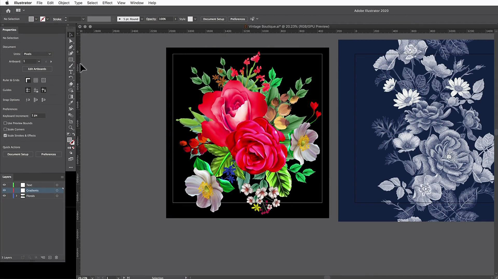
      </a>
      

      <a href="brandgradients.md"><strong>使用绚丽的渐变和Adobe[!DNL Stock]资源创建具有凝聚力的品牌形象</strong></a>
      

      <em>通过在广告营销活动中组合颜色和渐变，以各种图像创建品牌统一</em>
       
   </td>
  <td>
      <a href="webgraphics.md">
         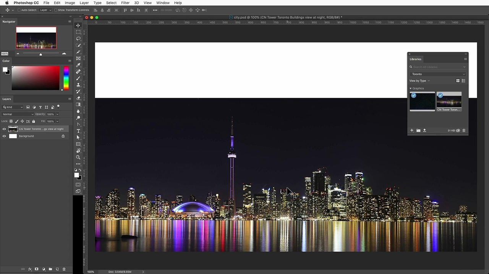
      </a>
      

      <a href="webgraphics.md"><strong>通过将Adobe [!DNL Stock]图像与CSS组合，创建引人入胜的Web图形</strong></a>
      

      <em>通过在广告营销活动中组合颜色和渐变，以各种图像创建品牌统一</em>
       
  </td>
</tr>
<tr>
   <td>
      <a href="moodboard.md">
         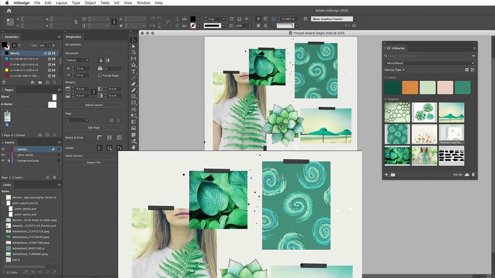
      </a>
      

      <a href="moodboard.md"><strong>使用Adobe [!DNL Stock]立即创建激发灵感的情绪板</strong></a>
      

      <em>创建项目情绪板，将信息、想法、视觉效果和调色板传递给团队/客户</em>
       
  </td>
  <td>
      <a href="realisticcomposite.md">
         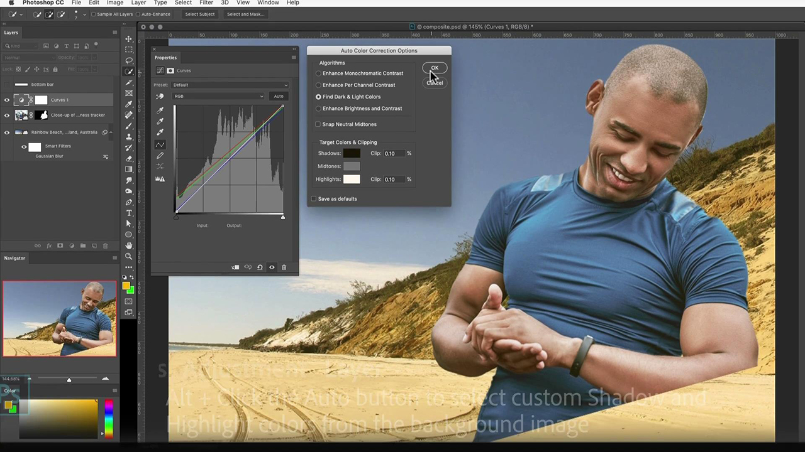
      </a>
      

      <a href="realisticcomposite.md"><strong>使用Adobe[!DNL Stock]图像创建逼真的照片合成</strong></a>
      

      <em>将两张精美的Adobe[!DNL Stock]照片合并，将人物吸引到您的社交帖子中</em>
       
  </td>
   <td>
   <a href="loadingscreen.md">
      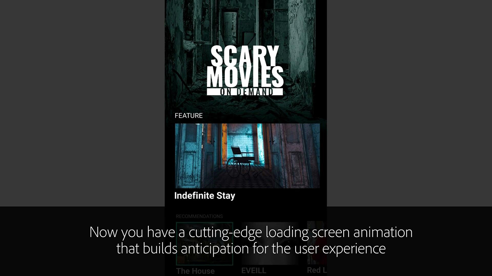
   </a>
    

   <a href="loadingscreen.md"><strong>使用Adobe [!DNL Stock]和XD自定义加载屏幕动画</strong></a>
    

    <em>从Adobe [!DNL Stock]自定义矢量图稿，为移动应用程序创建冷酷的加载屏幕动画</em>
     
  </td>
</tr>
<tr>
   <td>
   <a href="presentationtemplate.md">
      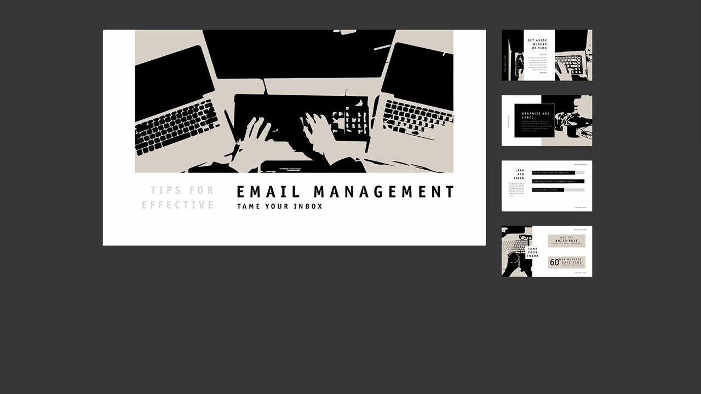
   </a>
    

   <a href="presentationtemplate.md"><strong>自定义Adobe[!DNL Stock]演示文稿模板，使其看上去专业，但引人注目</strong></a>
    

    <em>使用Adobe [!DNL Stock]中的图像和模板以及一些简单易用的特殊效果，在几分钟内创建出精美的风格化演示文稿</em>
     
  </td>
   <td>
   <a href="customizecolors.md">
      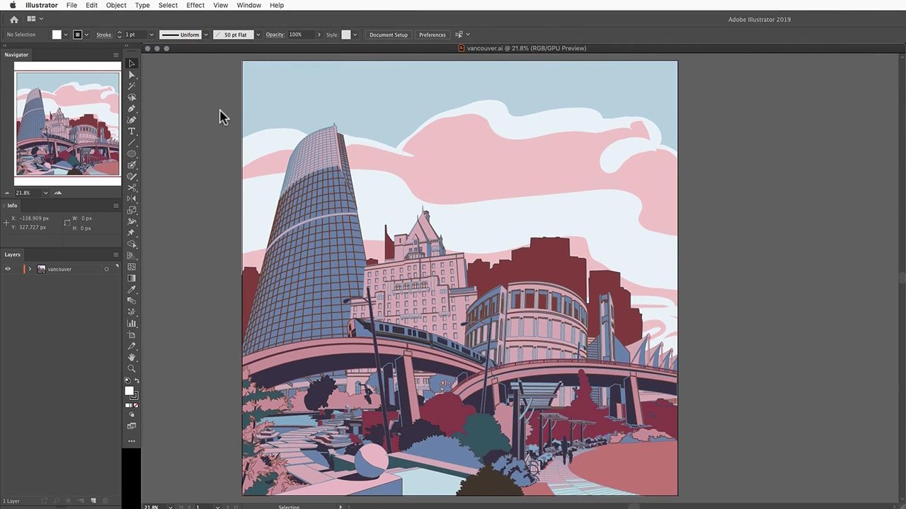
   </a>
    

   <a href="customizecolors.md"><strong>自定义Adobe[!DNL Stock]矢量插图中的颜色</strong></a>
    

    <em>通过精美的插图为任何项目添加润饰效果。在Adobe [!DNL Stock]中查找完美的矢量，然后使用Adobe Illustrator</em>将颜色与项目调色板匹配
     
  </td>
   <td>
      
      

      <a href="assets/AddMotiontoStillImageswithAdobeStockandPhotoshop.pdf"><strong>使用Adobe [!DNL Stock]和Photoshop向静止图像添加动画(PDF)</strong></a>
      

      <em>通过将视频融入静止图像，在任何屏幕上赢得观众的喝彩</em>
       
   </td>
</tr>
<tr>
   <td>
   <a href="assets/CreateacompositewithPhotoshopontheiPadandAdobeStockimages.pdf">
      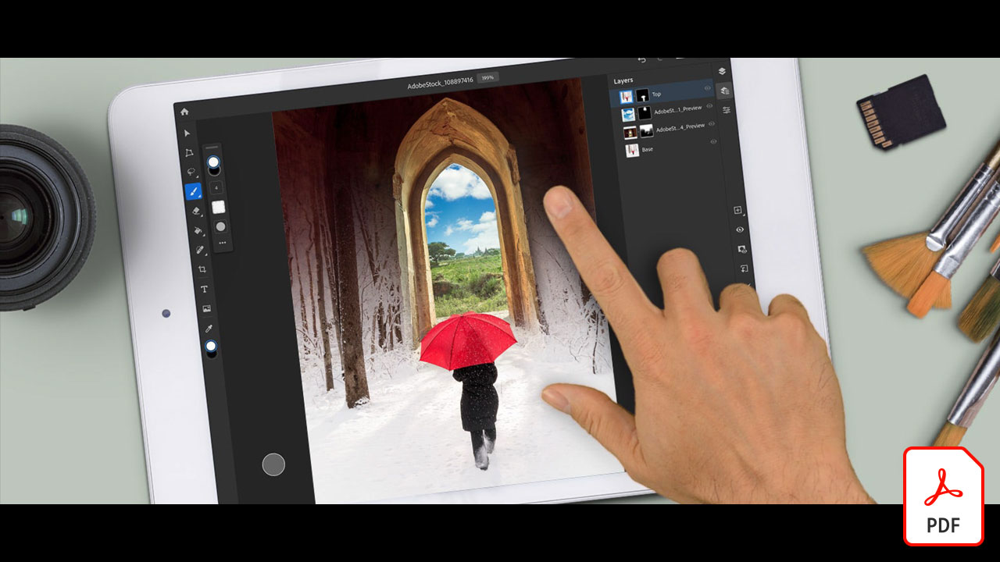
   </a>
    

   <a href="assets/CreateacompositewithPhotoshopontheiPadandAdobeStockimages.pdf"><strong>在iPad上使用Photoshop创建复合图像，并Adobe[!DNL Stock]图像(PDF)</strong></a>
    

    <em>了解如何在iPad上使用Photoshop的强大功能，以全新方式使用您最喜爱的Adobe Creative Cloud应用程序之一</em>
     
  </td>
   <td>
   
    

   <a href="assets/CreateaUniqueEditorialGraphicwithAfterEffectsandAdobeStock.pdf"><strong>在Photoshop中为Adobe[!DNL Stock]矢量插图制作动画(PDF)</strong></a>
    

    <em>通过将After Effects与Adobe [!DNL Stock]相结合，您可以快速创建出令人惊叹的特殊效果，帮助您直观地讲述故事</em>
     
  </td>
   <td>
      <a href="assets/CreateUniqueGraphicsbyCombiningAdobeStockImages.pdf">
         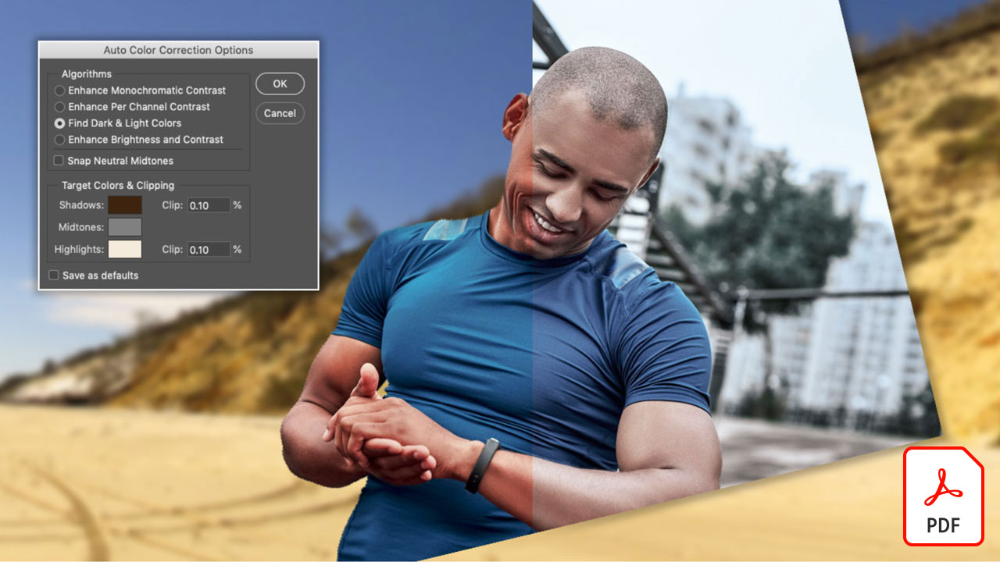
      </a>
      

      <a href="assets/CreateUniqueGraphicsbyCombiningAdobeStockImages.pdf"><strong>通过合并Adobe[!DNL Stock]图像(PDF)创建独特的图形</strong></a>
      

      <em>将两个不同的图像组合在一起，为设计项目创建一个全新的场景。Adobe[!DNL Stock]和Adobe Photoshop使操作</em>更简单
       
   </td>
</tr>
<tr>
   <td>
      <a href="assets/CreatingaHalloweenCinemagraphwithPhotoshopCCandAdobeStock.pdf">
         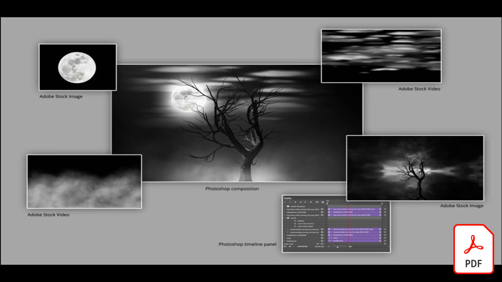
      </a>
      

      <a href="assets/CreatingaHalloweenCinemagraphwithPhotoshopCCandAdobeStock.pdf"><strong>使用Photoshop CC和Adobe [!DNL Stock]创建万圣节电影(PDF)</strong></a>
      

      <em>通过使用Adobe Photoshop将视频、插图和照片合成，创建摄影作品</em>
       
  </td>
   <td>
      <a href="assets/PutyourDatainMotionwithAdobeStockandPremierePro.pdf">
         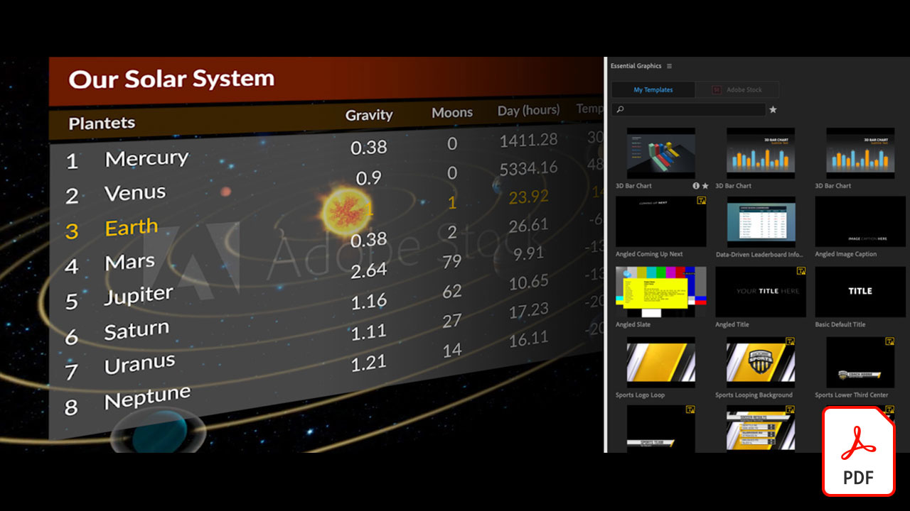
      </a>
      

      <a href="assets/PutyourDatainMotionwithAdobeStockandPremierePro.pdf"><strong>使用Adobe [!DNL Stock]和Premiere Pro(PDF)，使数据动态化</strong></a>
      

      <em>使用Adobe [!DNL Stock]和Adobe Premiere Pro，让您的数据栩栩如生，讲述更具说服力的故事</em>
       
  </td>
   <td>
      <a href="assets/RecolorAdobeStockVectorArtworkwithAdobeIllustratortoGetExactlytheLookYouWant.pdf">
         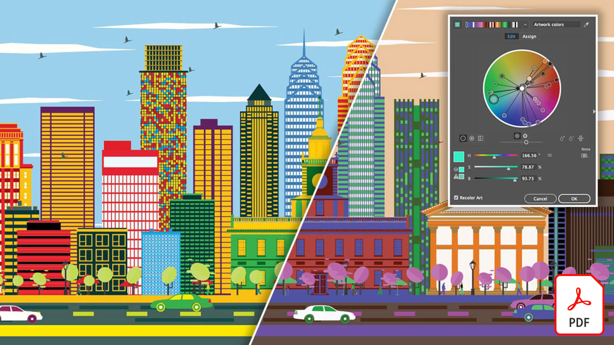
      </a>
      

      <a href="assets/RecolorAdobeStockVectorArtworkwithAdobeIllustratortoGetExactlytheLookYouWant.pdf"><strong>使用Adobe Illustrator重新着色Adobe[!DNL Stock]矢量图稿，以获得您想要的外观(PDF)</strong></a>
      

      <em>Adobe [!DNL Stock]使您能轻松找到独特的矢量图形，Adobe Illustrator使您能够快速修改图形以符合您的创意构想</em>
       
   </td>
 </tr> 
 <tr>
   <td>
      <a href="assets/ShowOffyourDesignWorkintheRealWorldwithAdobeStockandPhotoshop.pdf">
         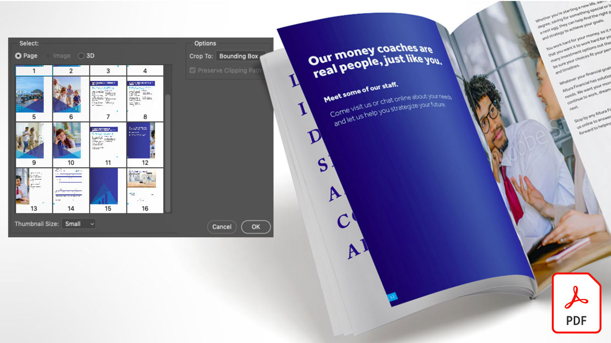
      </a>
      

      <a href="assets/ShowOffyourDesignWorkintheRealWorldwithAdobeStockandPhotoshop.pdf"><strong>使用Adobe [!DNL Stock]和Photoshop(PDF)在真实世界中展示您的设计作品</strong></a>
      

      <em>按照这些步骤，使用Adobe Photoshop在外观逼真的Adobe[!DNL Stock]模板中展示您的作品</em>
       
  </td>
   <td>
      <a href="assets/UncoveramazingdetailsinAdobeStockimageswithLightroomformobile.pdf">
         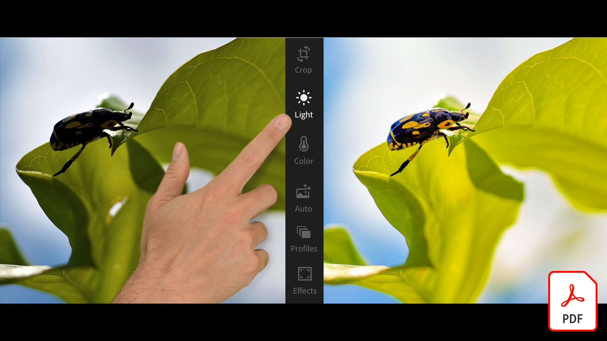
      </a>
      

      <a href="assets/UncoveramazingdetailsinAdobeStockimageswithLightroomformobile.pdf"><strong>借助Lightroom for mobile在Adobe [!DNL Stock]图像中发现令人惊异的细节(PDF)</strong></a>
      

      <em>发现移动设备上Lightroom的强大功能，让图像呈现最佳效果</em>
       
  </td>
   <td>
      <a href="assets/VisualizePosterDesignsintheRealWorldwithAdobeStockandPhotoshop.pdf">
         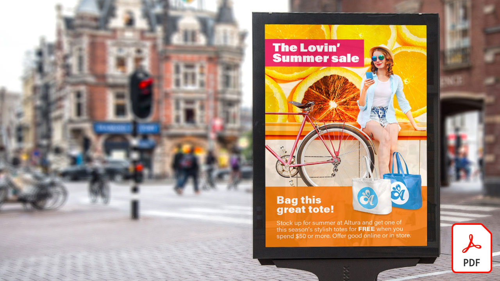
      </a>
      

      <a href="assets/VisualizePosterDesignsintheRealWorldwithAdobeStockandPhotoshop.pdf"><strong>使用Adobe [!DNL Stock]和Photoshop在真实世界中可视化海报设计(PDF)</strong></a>
      

      <em>在真实环境中展示您的设计，以更好地了解其在世界中的显示效果</em>
       
  </td>
</tr>
</table>
