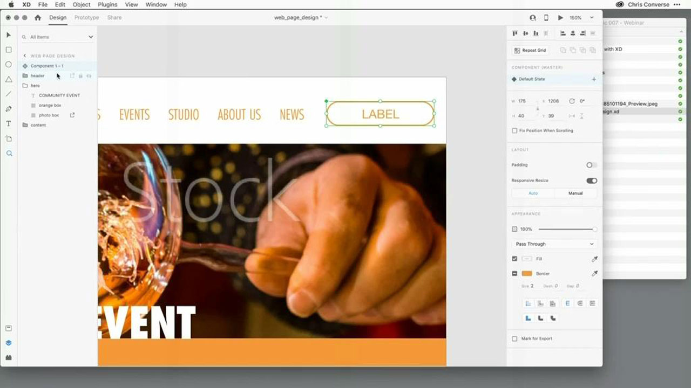
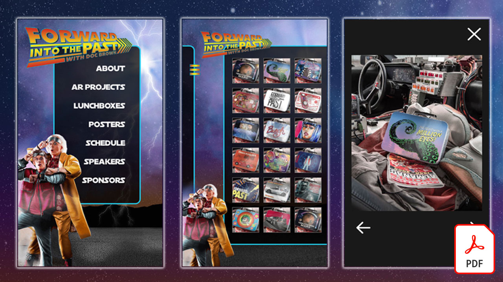
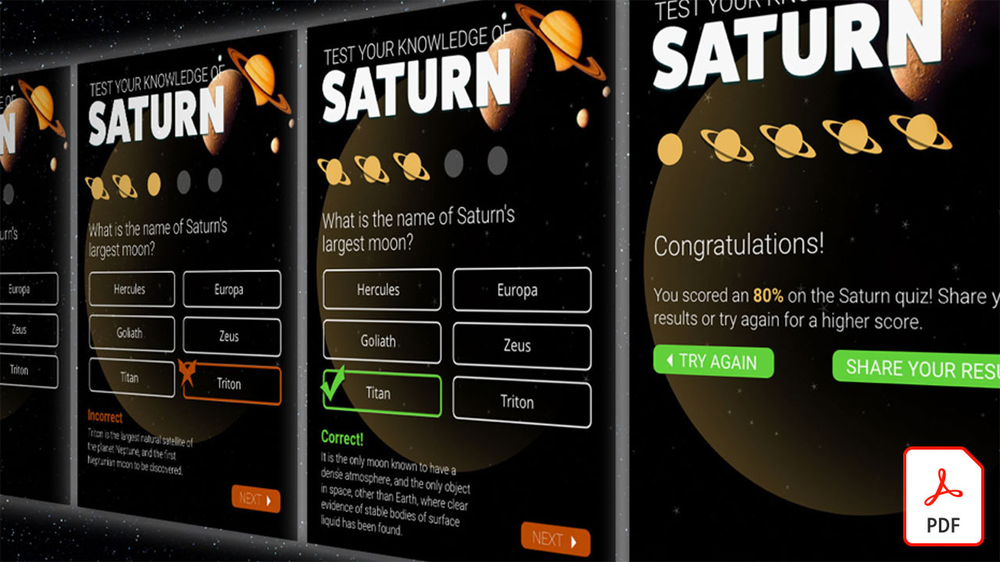
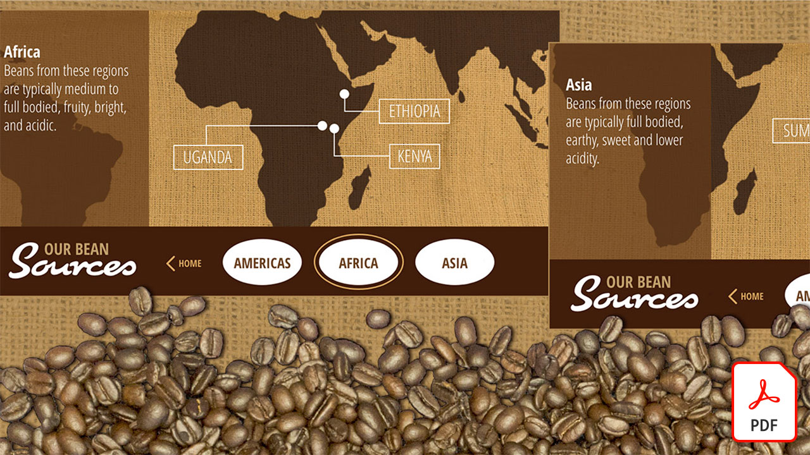
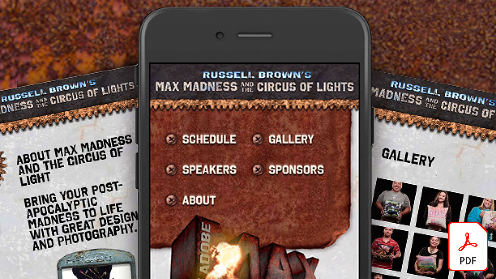
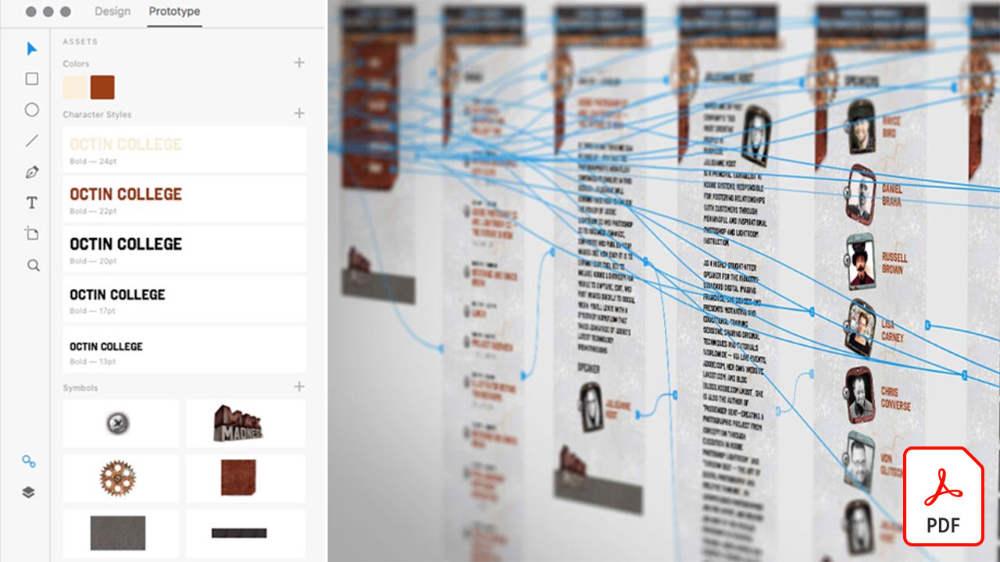
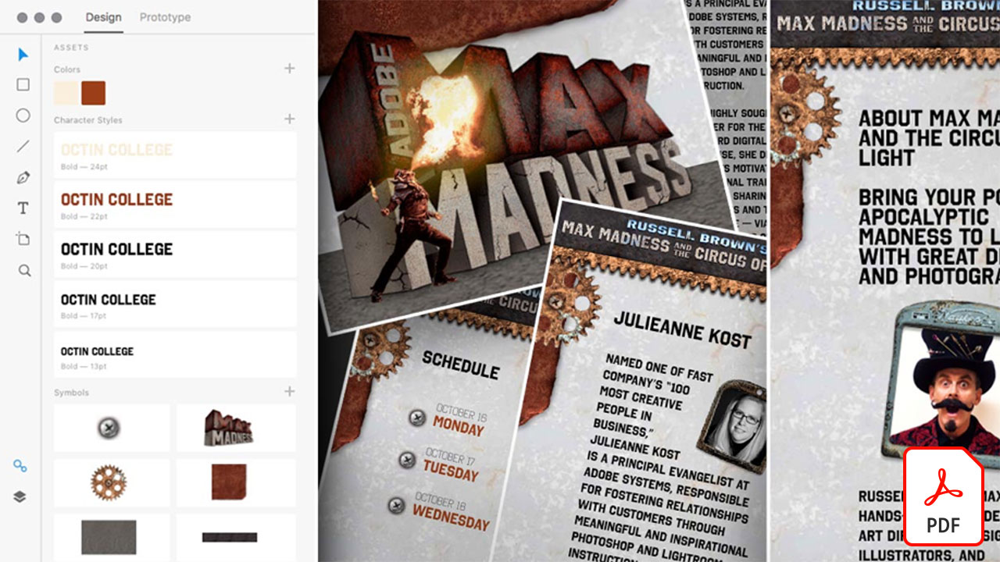

# Adobe XD教程

Adobe XD是一款用户体验设计和原型设计工具，用于设计网站、应用程序、语音界面、游戏和其他类型的数字体验。 选择一个图像以查看教程。

<table>
<tr>
 <td>
   
    

   <a href="components.md"><strong>在Adobe XD中轻松使用[！UICONTROL Components]</strong></a>
    

    <em>了解如何使用[！UICONTROL Components]为您提供前所未有的灵活性，以在设计工作流程中应用速度和一致性</em>
     
  </td>
  <td>
   
    

   <a href="assets/ControlMultipleXDArtboardswithNestedSymbols.pdf" target="_blank"><strong>使用嵌套符号控制多个XD画板(PDF)</strong></a>
    

    <em>符号提供了一种绝佳的方法来创建可在项目中的画板上多次应用的可重复使用的图稿和文本</em>
     
  </td>
  <td>
   
    

   <a href="assets/CreateaZoomableeCommercePhotowithXDandAdobeStock.pdf" target="_blank"><strong>使用XD和Adobe创建可缩放的电子商务照片 [!DNL Stock] (PDF)</strong></a>
    

    <em>将高分辨率摄影与Adobe XD的自动制作动画功能相结合，可为您的网站设计更吸引人的体验</em>
     
  </td>
  <td>
   
    

   <a href="assets/CreatingaRotatingProductInterfaceforECommercewithAdobeXD.pdf" target="_blank"><strong>使用Adobe XD创建电子商务的旋转产品界面(PDF)</strong></a>
    

    <em>设计一个界面，提供产品的旋转视图，然后您可以将设计转换为交互式原型，准确显示体验在Web或移动设备上的运行方式</em>
     
  </td>
</tr>
<tr>
  <td>
   
    

   <a href="assets/DesignandPrototypeanInteractiveQuizwithXD.pdf" target="_blank"><strong>利用XD设计交互式测验并制作其原型(PDF)</strong></a>
    

    <em>设计用户在项目期间将遇到的反馈</em>
     
  </td>
  <td>
   
    

   <a href="assets/DesignInteractiveProjectswithMicroAnimationsinXD.pdf" target="_blank"><strong>在XD中使用微动画设计交互式项目(PDF)</strong></a>
    

    <em>了解如何使用Adobe XD创建设计的交互式动画原型</em>
     
  </td>
  <td>
   
    

   <a href="assets/JumpstartyourXDProjectfromaPhotoshopFile.pdf" target="_blank"><strong>从Photoshop(PSD)文件(PDF)快速启动您的XD项目</strong></a>
    

    <em>Adobe XD提供了一些令人惊叹的交互式设计工具，这些工具可与您现有的工作流程结合使用，从而使您的交互式设计愿景更上一层楼</em>
     
  </td>
  <td>
   
    

   <a href="assets/MobileWebExperienceswithXD.pdf" target="_blank"><strong>使用XD设计移动Web体验(PDF)</strong></a>
    

    <em>了解使用Adobe XD的Russell Brown MAX Madness移动Web画廊的幕后设计流程</em>
     
  </td>
</tr>
<tr>
  <td>
   
    

   <a href="assets/PrototypeaMobileWebExperiencewithAdobeXD.pdf" target="_blank"><strong>使用Adobe XD为移动Web体验制作原型(PDF)</strong></a>
    

    <em>体验设计需要策略、设计和功能原型，而Adobe XD为您提供执行所有操作的强大功能</em>
     
  </td>
  <td>
   
    

   <a href="assets/PrototypeaMobileWebExperiencewithAdobeXD.pdf" target="_blank"><strong>使用外部文本和图形增强XD中的重复网格(PDF)</strong></a>
    

    <em>将重复网格与外部文本和图形相结合，以提高您的工作效率</em>
     
  </td>
  <td>
   
    

   <a href="assets/BehindtheScenesofMAXMadnesswithAdobeXD.pdf" target="_blank"><strong>MAX与Adobe XD(PDF)的幕后花絮</strong></a>
    

    <em>提供优化的移动Web体验确实能让您的用户产生共鸣</em>
     
  </td>
  <td>
    
    

     
  </td>
</tr>
</table>
